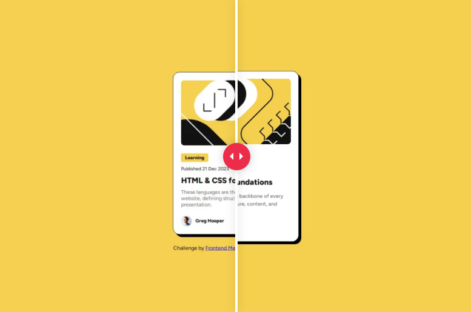

# Frontend Mentor - Blog preview card solution

This is a solution to the [Blog preview card challenge on Frontend Mentor](https://www.frontendmentor.io/challenges/blog-preview-card-ckPaj01IcS). Frontend Mentor challenges help you improve your coding skills by building realistic projects. 

## Table of contents

- [Overview](#overview)
  - [The challenge](#the-challenge)
  - [Screenshot](#screenshot)
  - [Links](#links)
- [My process](#my-process)
  - [Built with](#built-with)
  - [What I learned](#what-i-learned)
  - [Continued development](#continued-development)
  - [Useful resources](#useful-resources)
- [Author](#author)
- [Acknowledgments](#acknowledgments)

## Overview

### The challenge

Users should be able to:

- See hover and focus states for all interactive elements on the page

### Screenshot
First try

### Links

- Solution URL: (https://github.com/ErwiniaDev/FrontendMentor_BlogPreviewCard.git)
- Live Site URL: (https://erwiniadev.github.io/FrontendMentor_BlogPreviewCard/)

## My process

### Built with

- Semantic HTML5 markup
- CSS custom properties
- Flexbox

### What I learned

- the @font-face use for the download of the Google font
- the "align-items: flex-start" for the size of the "learning" tag

### Continued development

I have to improve my paddings, margins, sizes, ... from the Figma file. There is always errors.

### Useful resources

## Author

- Frontend Mentor - [@ErwiniaDev](https://www.frontendmentor.io/profile/ErwiniaDev)

**Note: Delete this note and add/remove/edit lines above based on what links you'd like to share.**

## Acknowledgments

Thanks to the Frontedn Mentor community!
